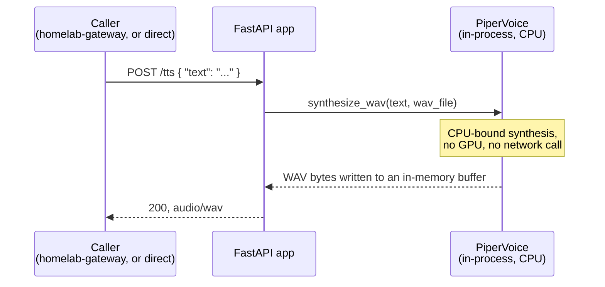
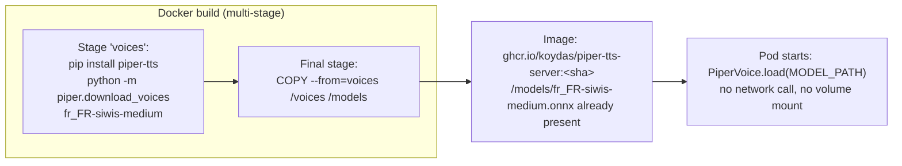
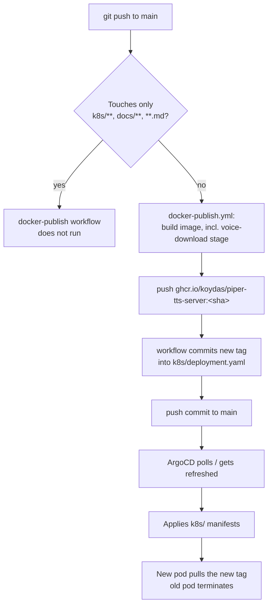
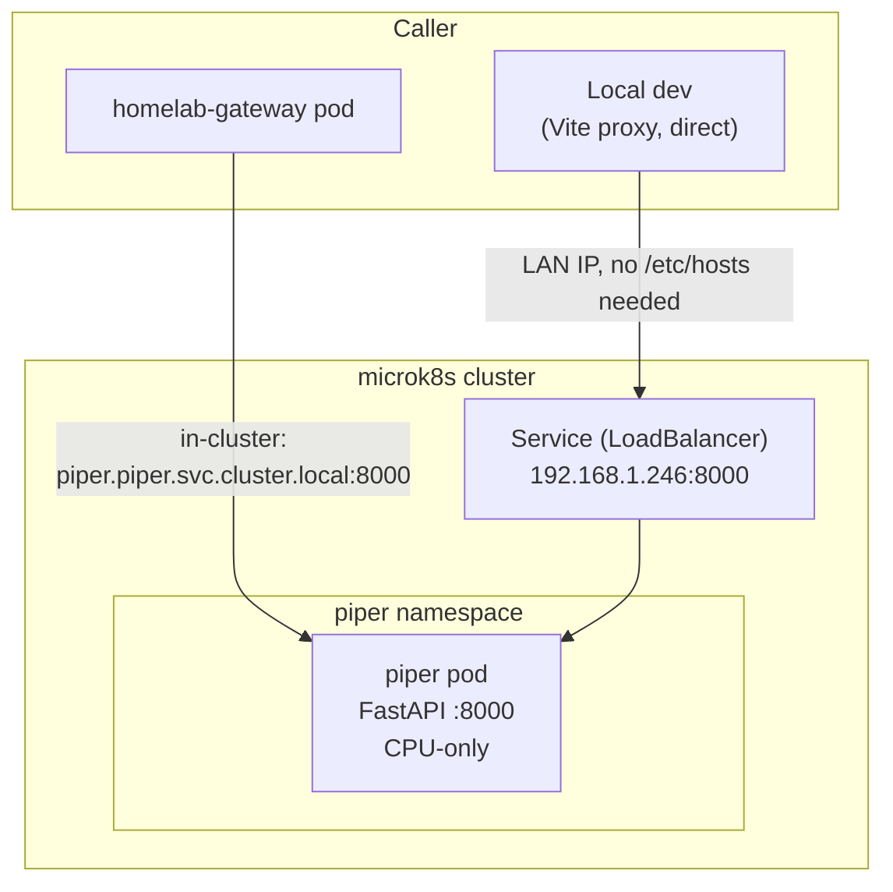

# Architecture

`piper-tts-server` is as small as it looks: one FastAPI process, one endpoint, one voice model
baked into the image. There's no state, no database, no config beyond the port — the only
non-obvious decision is *how* the voice model gets into the container, covered in
[ADR-0001](./adr/0001-bake-voice-model-at-build-time.md).

## Components

| Component | Role | Source |
|---|---|---|
| FastAPI app | `POST /tts`, `GET /healthz` | `app/main.py` |
| `piper-tts` (Python library) | Actual speech synthesis, CPU-only | `requirements.txt`, called via `PiperVoice.load()` |
| `fr_FR-siwis-medium` voice | The one voice this server can speak | baked into the image at build time, see ADR-0001 |
| ArgoCD + GHCR | Builds, publishes, and deploys this app on every push to `main` | `.github/workflows/docker-publish.yml`, `k8s/` |

This repo doesn't own the cluster/ArgoCD/MetalLB layer its Service runs on — see
[`gitops-homelab`'s architecture.md](https://github.com/koydas/gitops-homelab/blob/main/docs/architecture.md)
and that repo's [ADR-0016](https://github.com/koydas/gitops-homelab/blob/main/docs/adr/0016-onboard-whisper-piper-cpu-only.md)
(why this app exists, why CPU-only, why a custom wrapper instead of an off-the-shelf image).
The two real production callers are
[`homelab-gateway`](https://github.com/koydas/homelab-gateway) (routes `/tts`-shaped requests
here, see that repo's `docs/architecture.md`) and, through it,
[`ollama-chat`](https://github.com/koydas/ollama-chat)'s vocal mode (see that repo's
`docs/architecture.md` for the STT→chat→TTS round-trip this server is one leg of).

## Request flow

There's no streaming, no chunking, and no queueing — one request holds the process until
synthesis finishes and the full WAV buffer is returned. Given the resource limits in
`k8s/deployment.yaml` (2 CPU / 1Gi limit, single replica), a second request arriving mid-
synthesis queues behind FastAPI's own request handling rather than failing outright, but
there's no explicit backpressure or timeout configured here — a very long piece of text is the
only way this would become a real problem in practice.

## Voice model: baked in, not downloaded at runtime

See [ADR-0001](./adr/0001-bake-voice-model-at-build-time.md) for why this is baked in at build
time (a separate Docker build stage) instead of downloaded on pod start or mounted from a PVC.

## Deployment pipeline

Same three-step "build → tag-rewrite commit → ArgoCD sync" shape as this app's siblings
(`homelab-gateway`, `ollama-chat`) — see either of those repos' `docs/architecture.md` for the
general mechanics (`paths-ignore`, why the tag-rewrite commit doesn't re-trigger itself, and a
real race between ArgoCD's poll-sync and the tag-rewrite commit that's been hit in practice).
Unlike those two, this repo has no test suite yet, so nothing currently gates the build beyond
CI's implicit "did the Docker image build at all."

## Runtime topology

`192.168.1.246` is a dedicated MetalLB IP — not for production traffic (which reaches this pod
in-cluster, via `homelab-gateway`), but so `ollama-chat`'s local Vite dev server can call this
service directly without any backend running, the same way it already does for Ollama and
Whisper. See `gitops-homelab`'s ADR-0016 for the full reasoning on why every voice/STT backend
here got its own LAN-reachable IP.
