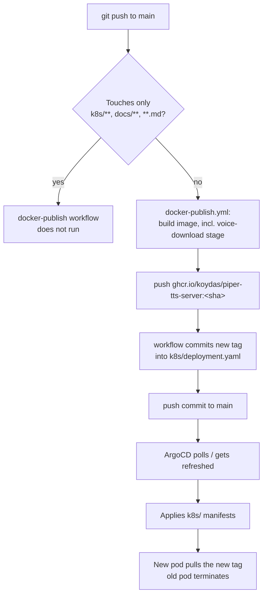

# Deployment pipeline

Same three-step "build → tag-rewrite commit → ArgoCD sync" shape as this app's siblings
(`homelab-gateway`, `ollama-chat`) — see either of those repos' `docs/deployment.md` for the
general mechanics (`paths-ignore`, why the tag-rewrite commit doesn't re-trigger itself, and a
real race between ArgoCD's poll-sync and the tag-rewrite commit that's been hit in practice).
Unlike those two, this repo has no test suite yet, so nothing currently gates the build beyond
CI's implicit "did the Docker image build at all."
